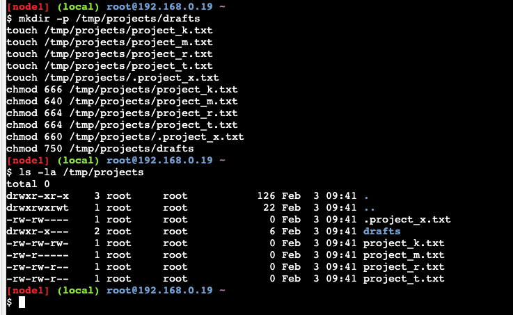
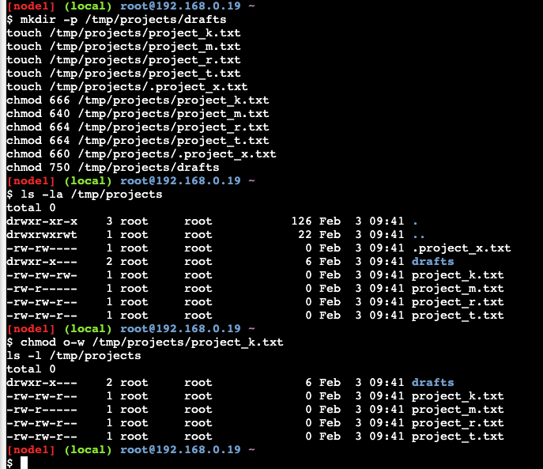
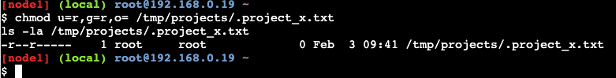
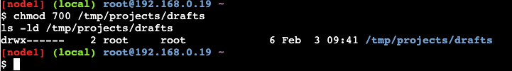

# Linux File Permissions

**Author:** Dariusz Piasecki
**Project Type:** File System Security – Permission Management  
**Environment:** Linux (Terminal)

---

## 📋 Project Description

As a security professional working with a research team at a large organization, my objective is to ensure that users are authorized with appropriate file and directory permissions. This project involves examining existing permissions on the file system, identifying any misconfigurations, and modifying them to comply with organizational security policies.

The analysis and changes were performed within the `/tmp/projects` directory using standard Linux commands (`ls`, `chmod`).

---

## 🎯 Objectives

1. Review current file and directory permissions in the target directory
2. Identify files and directories with unauthorized access
3. Modify permissions to align with organizational security policies
4. Verify changes were applied correctly

---

## 📁 Step 1: Review Current Permissions

The first step was to examine all files and directories, including hidden files, using the following command:

```bash
ls -la /tmp/projects
```

**Command Breakdown:**

| Flag | Purpose |
|------|---------|
| `ls` | Lists directory contents |
| `-l` | Displays detailed information (permissions, ownership, size) |
| `-a` | Includes hidden files (files starting with `.`) |

**Output:**



```
-rw-rw----  1 root  root  0 Feb  3 09:41 .project_x.txt
drwxr-x---  2 root  root  6 Feb  3 09:41 drafts
-rw-rw-rw-  1 root  root  0 Feb  3 09:41 project_k.txt
-rw-r-----  1 root  root  0 Feb  3 09:41 project_m.txt
-rw-rw-r--  1 root  root  0 Feb  3 09:41 project_r.txt
-rw-rw-r--  1 root  root  0 Feb  3 09:41 project_t.txt
```

### Permission String Breakdown

Using `project_k.txt` (`-rw-rw-rw-`) as an example:

| Position | Characters | Meaning |
|----------|------------|---------|
| 1st | `-` | Regular file (not a directory) |
| 2nd–4th | `rw-` | **Owner (user):** read + write |
| 5th–7th | `rw-` | **Group:** read + write |
| 8th–10th | `rw-` | **Others:** read + write |

### Initial Permission Summary

| File / Directory | Type | Owner | Group | Others | Issue |
|------------------|------|-------|-------|--------|-------|
| `drafts` | Directory | `rwx` | `r-x` | `---` | Group has access – should be owner only |
| `project_k.txt` | File | `rw-` | `rw-` | `rw-` | ⚠️ Others have **write** access |
| `project_m.txt` | File | `rw-` | `r--` | `---` | ✅ No issues |
| `project_r.txt` | File | `rw-` | `rw-` | `r--` | ✅ Others have read only |
| `project_t.txt` | File | `rw-` | `rw-` | `r--` | ✅ Others have read only |
| `.project_x.txt` | Hidden file | `rw-` | `rw-` | `---` | ⚠️ Group and owner have **write** access |

---

## 🔧 Step 2: Remove Write Access for Others

**Security Policy:** No file should allow write access for "others."

After reviewing the initial permissions, only `project_k.txt` had write access for others (`-rw-rw-rw-`). The files `project_r.txt` and `project_t.txt` already had read-only permissions for others (`-rw-rw-r--`), so no changes were required for them.

**Command Applied:**

```bash
chmod o-w /tmp/projects/project_k.txt
```

**Command Breakdown:**

| Component | Meaning |
|-----------|---------|
| `chmod` | Change file permissions |
| `o-w` | Remove (`-`) write (`w`) permission for others (`o`) |
| `/tmp/projects/project_k.txt` | Target file path |

**Verification:**

```bash
ls -l /tmp/projects
```



**Result:**

| File | Permissions Before | Permissions After | Change Applied |
|------|-------------------|-------------------|----------------|
| `project_k.txt` | `-rw-rw-rw-` | `-rw-rw-r--` | ✅ Write removed for others |
| `project_m.txt` | `-rw-r-----` | `-rw-r-----` | — No change needed |
| `project_r.txt` | `-rw-rw-r--` | `-rw-rw-r--` | — Already compliant |
| `project_t.txt` | `-rw-rw-r--` | `-rw-rw-r--` | — Already compliant |

---

## 🔧 Step 3: Modify Permissions on a Hidden File

**Security Policy:** The hidden file `.project_x.txt` must allow read access for the owner and group only. No write access for anyone.

**Command Applied:**

```bash
chmod u=r,g=r,o= /tmp/projects/.project_x.txt
```

**Command Breakdown:**

| Component | Meaning |
|-----------|---------|
| `u=r` | Set owner (user) permissions to read only |
| `g=r` | Set group permissions to read only |
| `o=` | Remove all permissions for others |

**Verification:**

```bash
ls -la /tmp/projects/.project_x.txt
```



**Result:**

| File | Permissions Before | Permissions After | Change Applied |
|------|-------------------|-------------------|----------------|
| `.project_x.txt` | `-rw-rw----` | `-r--r-----` | ✅ Write removed for owner and group |

---

## 🔧 Step 4: Restrict Directory Access

**Security Policy:** The `drafts` directory should only be accessible by its owner (`researcher2`).

The original permissions (`drwxr-x---`) allowed the `research` group to read and navigate the directory. To restrict access to the owner only, the permissions were changed using the numeric (octal) method.

**Command Applied:**

```bash
chmod 700 /tmp/projects/drafts
```

**Command Breakdown:**

| Value | Who | Permissions Granted |
|-------|-----|---------------------|
| `7` | Owner (user) | Read + Write + Execute (`rwx`) |
| `0` | Group | No permissions (`---`) |
| `0` | Others | No permissions (`---`) |

**Verification:**

```bash
ls -ld /tmp/projects/drafts
```



**Result:**

| Directory | Permissions Before | Permissions After | Change Applied |
|-----------|-------------------|-------------------|----------------|
| `drafts` | `drwxr-x---` | `drwx------` | ✅ Access restricted to owner only |

> **Note:** The `research` group previously had read and execute access to the `drafts` directory. Removing this access means other team members can no longer browse or read files inside `drafts`. This change should be confirmed with the team manager before deployment.

---

## 📊 Final Permissions Overview

After all changes were applied, the final state of the directory is as follows:

```
drwx------  2 root  root  6 Feb  3 09:41 drafts
-rw-rw-r--  1 root  root  0 Feb  3 09:41 project_k.txt
-rw-r-----  1 root  root  0 Feb  3 09:41 project_m.txt
-rw-rw-r--  1 root  root  0 Feb  3 09:41 project_r.txt
-rw-rw-r--  1 root  root  0 Feb  3 09:41 project_t.txt
-r--r-----  1 root  root  0 Feb  3 09:41 .project_x.txt
```

### Complete Change Summary

| File / Directory | Before | After | Action Taken |
|------------------|--------|-------|--------------|
| `drafts` | `drwxr-x---` | `drwx------` | Removed group access |
| `project_k.txt` | `-rw-rw-rw-` | `-rw-rw-r--` | Removed write for others |
| `project_m.txt` | `-rw-r-----` | `-rw-r-----` | No change – already compliant |
| `project_r.txt` | `-rw-rw-r--` | `-rw-rw-r--` | No change – already compliant |
| `project_t.txt` | `-rw-rw-r--` | `-rw-rw-r--` | No change – already compliant |
| `.project_x.txt` | `-rw-rw----` | `-r--r-----` | Removed write for owner and group |

---

## 🛠️ Commands Reference

| Command | Purpose | Used In |
|---------|---------|---------|
| `ls -la` | List all files including hidden, with details | Step 1 |
| `ls -l` | List files with permission details | Steps 2, 3 |
| `ls -ld` | List directory details (not contents) | Step 4 |
| `chmod o-w` | Remove write permission for others | Step 2 |
| `chmod u=r,g=r,o=` | Set exact permissions for user, group, others | Step 3 |
| `chmod 700` | Set permissions using octal notation | Step 4 |

---

## 🎯 Skills Demonstrated

| Skill Category | Specific Skills |
|----------------|-----------------|
| **Linux Administration** | File system navigation, permission management |
| **Security Hardening** | Identifying and fixing unauthorized access |
| **chmod Usage** | Symbolic (`o-w`, `u=r`) and octal (`700`) notation |
| **Access Control** | Least privilege principle, user/group/others model |
| **Documentation** | Step-by-step technical reporting with verification |

---

## 📧 Contact

**Dariusz Piasecki**  
📧 Email: dariusz.piasecki.sec@gmail.com  
🔗 LinkedIn: [linkedin.com/in/dariusz-piasecki](https://www.linkedin.com/in/dariusz-piasecki/)  
🐙 GitHub: [github.com/Dariusz-Piasecki](https://github.com/Dariusz-Piasecki)

---

*This project demonstrates practical Linux file permission management as part of a cybersecurity portfolio, focusing on access control and security hardening.*
